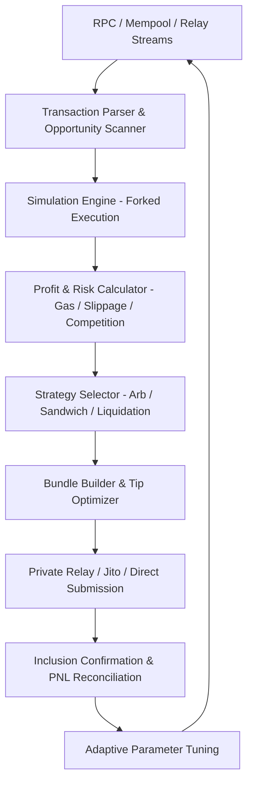

# MEV Bot v2026 

Deploy MEV Bot for real-time mempool monitoring, arbitrage, sandwich, and liquidation strategies with Flashbots/Jito bundle integration, low-latency RPC infrastructure, and risk-aware transaction routing. Advanced non-custodial automation layer for Ethereum, Solana, and multi-chain MEV capture.

### Introduction

MEV Bot functions as a high-frequency execution environment engineered to identify and capitalize on Maximal Extractable Value (MEV) opportunities arising from transaction ordering within blocks. It monitors mempools or private relays, simulates outcomes, constructs optimized bundles or priority transactions, and submits them through relays (Flashbots on Ethereum, Jito on Solana) or direct validator channels to secure advantageous positioning. The system emphasizes low-latency infrastructure, simulation engines, and non-custodial signing to operate in competitive DeFi ecosystems.

In 2026, with block production increasingly sophisticated, MEV Bots represent specialized automation layers that convert on-chain inefficiencies—arbitrage, liquidations, or sandwich opportunities—into systematic revenue streams for technically proficient operators.

### Inside the System: Core Mechanism

The bot operates as a searcher node within the MEV supply chain. It ingests pending transaction data, applies strategy-specific logic to detect profitable reorderings or insertions, simulates execution via local forks or RPC calls, and assembles atomic bundles that maximize value while compensating validators/builders. On Solana, it leverages Jito bundles and priority fees; on Ethereum, Flashbots-style private relays or SUAVE-like infrastructure.

Key layers include:
- **Mempool/Stream Ingestion**: High-throughput subscriptions to public mempools or private relays.
- **Opportunity Detection**: Pattern recognition for DEX price discrepancies, undercollateralized positions, or large swaps.
- **Simulation & Validation Engine**: Forked EVM/SVM execution to calculate net profit after gas/fees/slippage.
- **Bundle Construction**: Atomic transaction packaging with tips for inclusion priority.

### Target Audience and Operational Use Cases

Advanced developers, quantitative searchers, and professional trading firms with strong infrastructure are the primary users. Practical applications include:
- DEX arbitrage across liquidity pools or chains.
- Sandwich attacks around large user swaps (ethically controversial and increasingly protected against).
- Liquidation hunting on lending protocols.
- Back-running oracle updates or NFT mints.
- JIT liquidity provision or other sophisticated strategies.

The system requires deep blockchain knowledge, low-latency VPS/colocation, and acceptance of competitive dynamics.

### Technical Architecture and Workflow

MEV Bot architecture centers on speed, simulation accuracy, and private submission:
1. **Infrastructure Layer**: Dedicated RPC nodes, Geyser plugins (Solana), or mempool APIs with geographic optimization.
2. **Monitoring Engine**: Real-time parsing of pending transactions.
3. **Strategy & Simulation Core**: Rule-based or ML-augmented detection with stateful simulation.
4. **Bundle/Execution Router**: Construction and submission via relays with dynamic tipping.
5. **Risk & Telemetry**: Profit thresholding, failure handling, and performance analytics.

**Operational Logic**

This pipeline supports sub-second reaction in high-throughput environments.

### Key Features and Performance Considerations

- **Multi-Chain Support**: Optimized for Ethereum (Flashbots/mev-boost), Solana (Jito), and emerging L2s.
- **Bundle & Private Flow**: Atomic execution to minimize front-running of the bot itself.
- **Strategy Library**: Arbitrage, liquidation, sandwich, JIT, and custom logic.
- **Simulation Fidelity**: Accurate gas estimation and state replay to reduce failed bundles.
- **Infrastructure Scalability**: Support for node fleets and low-latency connectivity.

**Optimization Note**: Profitability hinges on infrastructure quality (dedicated nodes, colocation), competition levels, and strategy sophistication. Public RPCs are insufficient; simulation accuracy directly impacts success rate.

### Where It Fits in the Market: Positioning

MEV Bots represent professional-grade infrastructure, distinct from retail trading tools by focusing on block-level transaction ordering rather than directional speculation.

| Aspect              | MEV Bot                | General Arbitrage Bots | Sandwich/Trading Snipers | Manual MEV Hunting |
|---------------------|------------------------|------------------------|--------------------------|--------------------|
| Execution Speed     | Ultra High (bundle-level) | High                  | High                    | Low               |
| Risk Management     | Simulation & thresholds| Basic                 | Configurable            | None              |
| Ease of Use         | Advanced Developer     | Intermediate          | Intermediate            | Expert            |
| Setup Time          | Hours to Days          | 30-90 minutes         | 15-60 minutes           | Ongoing           |
| Automation Depth    | Block ordering         | Trade routing         | Signal-based            | None              |
| Relay / MEV Support | Native                 | Limited               | Variable                | N/A               |
| Best Use Case       | Professional searchers | Cross-DEX arb         | Launch sniping          | Observation       |

### Risk Surface and Limitations

- **Technical & Smart Contract Risk**: Bugs in simulation or bundle logic can lead to capital loss or exploits.
- **Competition & Negative Sum**: Intense rivalry compresses edges; many bots operate at a loss after infrastructure costs.
- **Regulatory & Ethical Exposure**: Certain strategies (e.g., sandwiching) face growing scrutiny and anti-MEV protections.
- **Infrastructure Dependency**: Relay downtime or RPC failures cause missed opportunities.
- **Capital & Volatility Risk**: Failed bundles still incur gas costs; strategies can amplify losses.

MEV extraction involves significant operational and financial risk with no guarantees.

### Deployment Notes

1. Provision low-latency infrastructure (dedicated nodes, VPS near relays).
2. Implement or fork open-source frameworks (Rust/Go preferred for performance) with secure key management.
3. Configure strategies, simulation parameters, tipping logic, and monitoring.
4. Extensive backtesting and shadow mode (simulation without submission) before live capital deployment.
5. Implement robust logging, alerting, and circuit breakers for anomalies.

Validate relay connectivity, bundle success rates, and security audits prior to production.

### Conclusion

MEV Bot delivers a sophisticated execution layer for capturing value from blockchain transaction ordering dynamics. Through advanced mempool monitoring, precise simulation, and private bundle submission, it supports systematic operations in competitive environments like Ethereum and Solana. Success demands exceptional infrastructure, continuous strategy refinement, rigorous risk controls, and technical expertise. Approach it as professional-grade blockchain infrastructure requiring substantial investment and ongoing adaptation.

### FAQ

**Is MEV Bot safe for deployment?**  
Non-custodial implementations with audited code and isolated environments reduce risks, but smart contract vulnerabilities and infrastructure exposure remain significant. Thorough security audits are mandatory.

**Does it support Solana and Ethereum simultaneously?**  
Yes. Modern frameworks provide multi-chain capabilities with chain-specific optimizations (Jito for Solana, Flashbots for Ethereum).

**Is it suitable for beginners?**  
No. MEV bot development and operation require advanced programming, blockchain mechanics knowledge, and dedicated infrastructure. Beginners should study open-source examples before attempting live deployment.

**How does it compare to simple arbitrage or sniper bots?**  
MEV Bots focus on block-level ordering and bundle execution, offering deeper integration with relays and higher sophistication than basic trade routers or launch snipers.

**What are the primary risks?**  
Code exploits draining contract funds, unprofitable operation due to competition and costs, regulatory scrutiny of certain strategies, and technical failures leading to lost gas or missed opportunities. Conservative testing and diversified strategies are essential.
